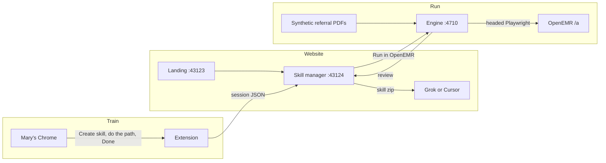

# ContextNinja

**Project title:** ContextNinja  
**Event:** Cursor Austin × AITX · 19 Sep 2026 · Team Ninja  
**Repo:** https://github.com/bo-lora/AITX-Hackathon-Sep-19-2026-Team-Ninja-  
**Demo video:** _paste Loom URL here_  
**Deployed URL:** none. The app runs on the demo laptop (landing `:43123`, skill manager `:43124`, engine `:4710`). Use the Loom, or a screen capture, as the working-app evidence.

Train is the **Chrome extension**. Run is the **next referral fax** on OpenEMR. The operator starts on the website and leaves with a **skill folder**.

Judge walk (short): [`docs/demo.md`](docs/demo.md). Submission checklist: [`docs/submission.md`](docs/submission.md).

---

## Quick start

Needs Node 20+, Python 3, and `pdftotext` (`brew install poppler` on macOS). **No API keys.**

```bash
git clone https://github.com/bo-lora/AITX-Hackathon-Sep-19-2026-Team-Ninja-.git
cd AITX-Hackathon-Sep-19-2026-Team-Ninja-
pnpm install
cp .env.example .env
cd packages/engine && npm install && npx playwright install chromium && PLAYWRIGHT_BROWSERS_PATH=0 npx playwright install chromium && cp .env.example .env && cd ../..
```

Two terminals:

```bash
pnpm dev
```

```bash
npm start --prefix packages/engine
```

- Landing: http://127.0.0.1:43123
- Team: http://127.0.0.1:43123/team
- Skill manager: http://127.0.0.1:43124
- Engine: `curl -s http://127.0.0.1:4710/health`

Chrome → Extensions → Load unpacked → `packages/extension`.

---

## Tech stack and architecture

- **Web:** Next.js 16, TypeScript, pnpm workspaces (`@contextninja/landing-page`, `@contextninja/skill-manager`, `@contextninja/backend`)
- **Train:** Chrome MV3 extension — live DOM events, no keys, POST to the skill manager
- **Run:** Playwright Chromium on a local Node HTTP server (`packages/engine`, port 4710)
- **PDF:** Python 3 + `pdftotext -layout` (poppler), rule-based, three layouts
- **Target:** OpenEMR public demo 8.4.0 at `https://demo.openemr.io/a/openemr` (public login `admin` / `pass`)



`packages/compiler` is **later**: ground taught steps onto OpenAPI where the spec has a call. It is not train and not this run.

---

## How to reproduce the demo

Copy the sample env. Leave optional keys empty.

```bash
cp .env.example .env
cp packages/engine/.env.example packages/engine/.env
```

Root `.env.example`:

```
# GROK_API_KEY=
# OPENEMR_ENGINE_URL=http://127.0.0.1:4710
```

Engine `.env.example` (the demo reads these two; the rest are optional and skip themselves when blank):

```
OE_SITE_URL=https://demo.openemr.io/a/openemr
PORT=4710
SUPABASE_URL=
SUPABASE_SERVICE_ROLE_KEY=
APIFY_TOKEN=
```

Never put a key in the extension. Never commit `.env`. The product path never takes her password: she types `pass` in a headed login window; only the browser session is saved (git-ignored).

**Train**

1. Landing → download / load the extension unpacked.
2. **Create skill**. Inbox → OpenEMR login → patient, visit, insurance, attach the PDF. **Done**.
3. Edit the path → **Save** → **Download skill folder**.

**Run**

1. Skill page → **Run in OpenEMR**. Type `pass` in the login window if it opens.
2. **Open review** — fax vs what was saved.

Short on time: landing **Skip train — open a taught skill**, then Run. Engine must already be up.

Stage EHR resets nightly 08:00 UTC. Book weekdays. Patients we create are `HACKDEMO-…` only.

---

## Datasets and provenance

All people, clinics, phones, NPIs, and member IDs are **fictional**. No real patient data.

- `packages/engine/referrals/` — 10 synthetic referral PDFs (`referral-01.pdf` … `10`) plus `referrals.json` answer key. Generated by `referrals/generate.py` (reportlab), checked by `referrals/verify.py`. Last names `HACKDEMO-…`. Phones `512-555-01xx`. NPIs start with `9`. Three layouts: letterhead, form, fax cover. Two files have a faxed look (speckle/rotation) with real extractable text.
- Carriers used in generation are demo-dropdown names, not production insurers.
- OpenEMR public demo is a shared site. We only create `HACKDEMO-` records. We do not edit or delete anyone else's patients.
- Stock demo names mentioned read-only (Phil Belford, Billy Smith) were already on the public site.
- Screenshots and raw recorder exports are **not** in git (live session URLs / other people's patients on the Finder). Re-run locally to regenerate.

---

## Known limitations and next steps

**Limits**

- PDF extract is rule-based on **these** three layouts, not any fax.
- Login and headed run need a laptop with a screen.
- Shared public EHR; other people can change it; it resets nightly.
- One app (OpenEMR), one workflow (referral intake). Attach-fax and billing have no usable API on this path — Run is Playwright, not REST.
- Extension train is tab/frame capture in **her** Chrome. Skip-train uses a seeded sample so a judge can still Run.

**Next**

- Compile taught steps onto OpenAPI where the spec has the call (`packages/compiler`). Leave UI for the rest.
- More layouts / more apps, still taught in the live browser first.

---

## Team roster

| Name | This weekend | Contact |
| --- | --- | --- |
| Bo Lora | Product, landing, skill manager | [LinkedIn](https://www.linkedin.com/in/bolora) |
| Pranav Narahari | OpenAPI compiler (later) | [LinkedIn](https://www.linkedin.com/in/pranavnarahari/) |
| Aurora Quinn-Elmore | Team | [LinkedIn](https://www.linkedin.com/in/auroraquinnelmore/) |
| Travis Mathis | Team | [LinkedIn](https://www.linkedin.com/in/travismathis138) |

QR cards: http://127.0.0.1:43123/team

---

## Write-up

Front-desk staff still copy referral faxes from email into an EHR that was never built for that job. The PDF lands in the inbox. Then they log in, create a patient, book a visit, enter insurance, and attach the same file under Medical Record. Those four screens do not exist until they walk them. A snapshot of one form cannot see the next. A billing API, when it exists, does not cover this path.

ContextNinja is for that operator — Mary at the front desk — not for people who already live in Cursor. She does the dreadful path one more time in her own Chrome, where her email and EHR cookies already are. The extension records the live DOM. Done sends the session to a website. She edits, saves, and downloads a skill folder she can drop into Grok or Cursor. Required inputs (this fax, this login) are asked for on the next run instead of guessed from the teach example.

Run is the next referral, not a replay of the same patient. A headed Playwright engine fills the OpenEMR public demo from synthetic HACKDEMO faxes we generated. She types the password in a visible window. It is never stored. A review page compares the fax to what was saved.

This weekend: teach once, then the swivel chair stops for the next fax, and she still holds the last mile. We do not claim any fax on earth, a production EHR, or training from video. Grounding taught steps onto OpenAPI, only where the spec actually has a call, is next.
