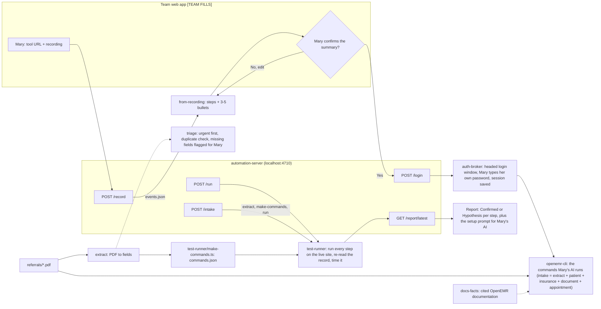

# [TEAM FILLS: project name]

Turn one screen recording of a repetitive browser task into tested commands your AI can run, with evidence for every step. Built for tools that have no API the user can actually use (it's switched off, locked behind IT, or doesn't exist).

Mary runs the front desk on software from 2005 with no API. She records one video of her morning routine. Ninety seconds later, her AI does it for her — and shows its work.

The demo workflow is **referral fax intake** on OpenEMR: for each referral PDF, the front desk creates the patient (demographics and insurance), attaches the referral PDF to the patient's Documents, and books a new-patient appointment. The demo runs a batch of 10.

## Quick start

Needs Node 20+ (built on Node 25), Python 3, and poppler's `pdftotext` for the PDF extractor (`brew install poppler` on macOS).

```
git clone [TEAM FILLS: repo URL]
cd [TEAM FILLS: repo folder]
npm install
npx playwright install chromium
PLAYWRIGHT_BROWSERS_PATH=0 npx playwright install chromium
npm start
```

Then check the automation server is up:

```
curl http://localhost:4710/health
```

It answers `{"ok": true, ...}`. To use a different port: `PORT=4799 npm start`.

Why two browser installs: the test-runner (started by `POST /run` and `POST /intake`) uses Playwright's default browser folder, while auth-broker, the recorder and `openemr-cli` keep the browser inside `node_modules/` (`PLAYWRIGHT_BROWSERS_PATH=0`). `npm run browsers` runs both.

`npm install` also runs `scripts/link-node-modules.mjs`, which points each tool folder's `node_modules` at the single root install.

## Tech stack

- Browser automation: Playwright 1.63 (Chromium), TypeScript run with tsx. Headed only for the login window; headless for everything else.
- Local automation server: Node's built-in `http` module, no framework (`automation-server/server.ts`).
- Referral PDF extraction: Python 3 standard library plus `pdftotext -layout` (poppler). Rule-based, no LLM.
- Recording to workflow: Python 3 standard library. Rule-based; if `ANTHROPIC_API_KEY` is set it can reword only the summary bullets (optional, and it falls back to the rule-based bullets on any failure).
- Synthetic test data: Python 3 with reportlab and pypdf (`requirements.txt`).
- Optional integrations, NOT yet connected (no keys have been set up, so neither has run against a real Supabase or Apify account; not needed for the demo or the quick start): Supabase (audit trail and a public review link, `supabase-sync/`) and Apify (crawl of the OpenEMR docs into Postgres full-text search, `docs-crawl/`). Both are Python standard library only and skip themselves when their keys are absent.
- Frontend web app: [TEAM FILLS]
- Video understanding model and provider: [TEAM FILLS]

## Architecture



What each folder does:

| Folder | What it is |
|---|---|
| `automation-server/` | Local HTTP server the web app calls. Endpoints: `GET /health`, `GET /status`, `POST /login`, `POST /record`, `GET /recordings/latest`, `POST /run`, `POST /intake` (one-button batch: extract every referral PDF, build the commands, run them), `GET /intake/latest`, `GET /review/latest` (review page for the latest intake), `POST /review/<id>/mark`, `GET /report/latest`, `GET /report/latest.json`. Default site is `/a`; each site has its own saved login. One browser job at a time. |
| `auth-broker/` | "Mary logs in herself." Opens a headed login window, saves the Playwright session to a file (mode 600), checks it headlessly later, and re-opens the login window if the session expired. Never reads or stores the password. |
| `automation-server/recorder.ts` | Captures Mary's clicks and typing on the live site. Password fields are written as `[hidden]`. |
| `from-recording/` | Turns the recorder's events into a list of steps and a 3-5 bullet summary for Mary to confirm. |
| `extract/` | Reads a referral PDF and returns the patient, insurance and appointment fields as JSON. |
| `triage/` | `./triage/triage --dir referrals --extra triage/fixtures --out triage/triage.json` runs before entry: sorts urgent referrals first, checks the demo read-only for an existing patient with the same last name and date of birth, and flags missing or malformed fields for Mary instead of guessing. Writes `triage.json` and a plain-language `needs-mary.md`. |
| `openemr-cli/` | The `openemr` command-line tool Mary's AI runs: one subcommand per step of the workflow. |
| `test-runner/` | Runs a `commands.json` against the live site, re-reads every record on a fresh page load to verify it, times each step, and writes `report.html` and `report.json`. |
| `referrals/` | 10 synthetic referral fax PDFs, their answer key, the generator and the round-trip check. |
| `docs-facts/` | Facts quoted from the official OpenEMR documentation, each checked by script against a saved copy of the page in `docs-facts/sources/`. |
| `supabase-sync/` | OPTIONAL, not yet connected (no keys). Uploads one run to Supabase (tables `runs`, `referrals`, `steps`, `reviews`, plus a public review page). Skips with `keys absent — skipped` when `SUPABASE_URL` / `SUPABASE_SERVICE_ROLE_KEY` are not set. |
| `docs-crawl/` | OPTIONAL, not yet connected (no keys). Crawls the OpenEMR wiki with Apify into Postgres full-text search; `./docs-crawl/docs-search "<query>" --backend mock` works with no keys, from the saved pages in `docs-facts/sources/` (build the local index first with `python3 docs-crawl/crawl.py --mock`). |
| `ground-truth/` | The click path walked by hand on the live demo, used to score `from-recording/`. |

Each folder has its own README with the full commands where one was written.

## How to reproduce the demo

Demo target: the OpenEMR public demo (version shown on the demo page: 8.4.0).

- Instance list: https://www.open-emr.org/demo/
- **Demo instance: https://demo.openemr.io/a/openemr** (login page https://demo.openemr.io/a/openemr/interface/login/login.php). We use the `/a` backup instance for the demo because it is cleaner; the main instance https://demo.openemr.io/openemr was used for testing, and https://demo.openemr.io/b/openemr is the fallback.
- Login used for the whole demo: the public OpenEMR demo login `admin` / `pass`. This is the test login posted publicly on the OpenEMR demo page, not a secret. The `receptionist` login cannot open patient Documents ("Documents Not Authorized"), so the demo uses admin.

**No API keys are needed.** The demo and the quick start work without any keys. The sample `.env` has the two server settings plus three empty names used only by the optional integrations:

```
cp .env.example .env
```

```
OE_SITE_URL=https://demo.openemr.io/a/openemr
PORT=4710
SUPABASE_URL=
SUPABASE_SERVICE_ROLE_KEY=
APIFY_TOKEN=
```

Leave the last three empty unless you want the optional Supabase / Apify integrations; `supabase-sync/` and `docs-crawl/` read them from `.env` and skip themselves when they are missing. Never commit a real `.env` (it is git-ignored).

The automation server reads its two settings from the environment, so start it with them set, for example `OE_SITE_URL=https://demo.openemr.io/a/openemr npm start`. The server's default instance is already `/a`. Endpoints take `"site": "main" | "a" | "b"` in the request body to override, and `run.ts` and `openemr` take `--site a`.

Steps:

1. Start the server: `npm start` (default instance `/a`).
2. Log in once: `curl -X POST http://localhost:4710/login` (or `./openemr-cli/openemr login --site a`). A browser window opens on this machine; type the public demo login yourself. The password is not passed on the command line or stored; only the browser session is saved, to `automation-server/sessions/openemr-a.json` (git-ignored). The server's `/intake` batch uses only this saved session; there is no built-in password in it.
3. Extract the referrals: `./extract/extract --all referrals --out extract/extracted.json`
4. Build the batch from the extractor output: `cd test-runner && npx tsx make-commands.ts --source ../extract/extracted.json --out commands.referrals.json`
5. Run it: `npx tsx run.ts commands.referrals.json --site a` (all 10), or `curl -X POST http://localhost:4710/run -H 'content-type: application/json' -d '{"site": "a"}'` (defaults to `test-runner/commands.referrals-3.json`, 3 referrals). This older test path (`test-runner`) opens its own headless browser and logs in with the public demo login written in the command file (see below).
6. Open the report: http://localhost:4710/report/latest

Or do steps 3-5 in one call, which is what the demo uses: `curl -X POST http://localhost:4710/intake -H 'content-type: application/json' -d '{"limit": 3}'` (omit `limit` for all 10). It extracts each PDF and runs `openemr intake` with the saved session, and the results appear on the review page at http://localhost:4710/review/latest.

The last step of the demo is the "drop this into your AI" setup prompt Mary pastes into her assistant: `docs/setup-prompt.md`. It installs the `openemr` CLI and tells the AI which command runs each step (`openemr intake <referral.pdf>` does a whole referral). Its install paths were written for the build laptop and appear as `<repo>`.

All three demo instances reset nightly at 08:00 UTC, so patients created during a run disappear the next day. Book appointments on weekdays; the demo calendar shows a "Provider not available" popup on Sundays.

### Where the public demo login appears

The public OpenEMR demo logins (`admin` / `pass`, and `receptionist` / `receptionist` in the earliest run report, both posted on https://www.open-emr.org/demo/) are the only credentials anywhere in this repo. It appears in:

- the docs above, `ground-truth/`, and `from-recording/samples/SAMPLE-score.md` (which quotes the ground truth);
- the test-runner's unattended login step (`npx tsx oe.ts login --user admin --pass pass`) in `test-runner/commands*.json`, `test-runner/make-commands.ts`, `automation-server/commands.referral-1.json`, and the saved run reports in `test-runner/runs/` and `automation-server/test/out/`;
- the test-only login hook settings in `auth-broker/run-tests.sh` and `automation-server/README.md`.

The product path (`POST /login`, `POST /intake`, `openemr`) never takes a password: Mary types it into the browser window herself and everything after that uses the saved session. No session files, cookies or API keys are in the repo.

## Synthetic data and provenance

- Every patient, clinic, provider, phone number and member ID in this repo is fictional. They were generated by `referrals/generate.py` (reportlab) and checked by `referrals/verify.py`.
- Every patient last name starts with `HACKDEMO-`. Phone numbers are 512-555-01xx. NPIs start with 9.
- The OpenEMR public demo is shared with the public. We only create records whose last name starts with `HACKDEMO-`, and never edit or delete a record we did not create. `test-runner/oe-session.ts` refuses any last name without that prefix.
- `triage/fixtures/` holds 2 extra synthetic PDFs (an urgent referral and one with a missing member ID) to show the triage flags.
- No real patient data is used anywhere.
- Not in this repo: login sessions (they contain cookies), raw recorder exports, `node_modules`, and ALL screenshots and screen recordings. Some run screenshots show the shared Patient Finder with the demo site's own stock (non-`HACKDEMO-`) patients, so none are included; in the saved reports each screenshot is replaced with "[screenshot not included in the repo]". Re-running creates them locally.
- Two stock OpenEMR demo sample patients are named in the repo, both read-only and neither created or changed by us: "Phil Belford" (with DOB) is the triage duplicate-check positive control in `triage/`, and "Billy Smith" is the lookup in the human recording in `from-recording/human/`. `supabase-sync/test/` uses the name "Adeyemi" only to prove a non-`HACKDEMO-` row is rejected.

To regenerate and re-verify the PDFs:

```
python3 -m venv .venv && .venv/bin/pip install -r requirements.txt
cd referrals && ../.venv/bin/python generate.py && ../.venv/bin/python verify.py
```

## Proof files

- Demo video (60 s split screen, 1.3 MB): kept outside this repo at `submission/recordings/referral-demo-splitscreen-v1.mp4` on the build laptop, because no video or screenshot is committed here until someone has checked every frame for non-`HACKDEMO-` patients. [TEAM FILLS: link once hosted]

- `extract/score.txt`: extractor accuracy against the answer key, field by field (290/290 fields across 10 PDFs at packaging time).
- `auth-broker/test-log.txt`: the login, expired-session and re-login tests. The two `test-log-run*-FAILED-*.txt` files are the earlier failed runs, kept on purpose; their file names say what was wrong.
- `automation-server/test-log.txt` and `automation-server/test/out/`: endpoint tests against the running server, with the raw responses.
- `test-runner/runs/<timestamp>/report.html` and `report.json`: every test run, oldest to newest. Screenshots (`shots/`) are left out of the repo (see Synthetic data and provenance); re-running creates them.
- `from-recording/human/`: the workflow built from a human Chrome DevTools Recorder capture ("Mary_OpenEMR_Baseline_001", a patient lookup, not the referral intake), with a hand score. The raw recorder export is not in the repo because its URLs carried a live session token.
- `python3 from-recording/test_from_recording.py`: unit checks for recording-to-workflow (password masking, noise merging, 3-5 bullets). Any from-recording score in this repo was measured on a scripted test recording made by the server's automated `/record` test, not a human recording. The score in `from-recording/samples/SAMPLE-score.md` is circular (the sample was hand-made from the same ground truth it is scored against) and is not a result.
- `docs-facts/facts.md`: each quote with its source URL.
- `supabase-sync/test/test_sync.py`: runs against a local mock of Supabase. In this repo copy 2 of its checks fail only because the run screenshots (`shots/`) are left out of the repo, so the review page's image links 404.
- `scripts/secrets-scan.sh`: checks the committed files for session files, cookie values, tokens and keys, and lists every place the public demo login appears. OpenEMR's per-login session token (`token_main`) is stripped from every captured URL, and it fails if one is found. `from-recording/inputs/` (raw Chrome Recorder exports, which contain live session URLs) is not in the repo.

## Known limitations

- Extraction is rule-based and handles 3 referral layouts only (letterhead, form, fax cover). An unknown layout is not extracted.
- The login window is headed, so the server has to run on a laptop with a screen.
- The demo runs on a shared public site that anyone can change and that resets nightly, so results depend on its state at run time.
- Tested on one app (OpenEMR) and one workflow so far.
- `from-recording/samples/` is a hand-made sample; its frame titles and some selectors are UNVERIFIED against a real recording.
- [TEAM FILLS: which steps were Hypothesis ? rather than Confirmed ✓ in the final demo run]

## Next steps

- AI extraction for referral layouts the rules don't know.
- Learn workflows from videos, including existing YouTube tutorials, not only from the user's own recording.
- More apps. The approach works on anything that runs in a browser.
- [TEAM FILLS: anything else the team plans]

## Who built what

- Helper tools in this repo (`auth-broker`, `automation-server`, `extract`, `from-recording`, `triage`, `openemr-cli`, `test-runner`, `referrals`, `docs-facts`, `ground-truth`, `supabase-sync`, `docs-crawl`): built during the hackathon by Claude Code agents, each working from a written task spec and reviewed by the team.
- The web app, the video-to-workflow step and the demo: [TEAM FILLS]
- `sync.sh` copied the tool folders into this repo; it is kept so the copy can be refreshed.
