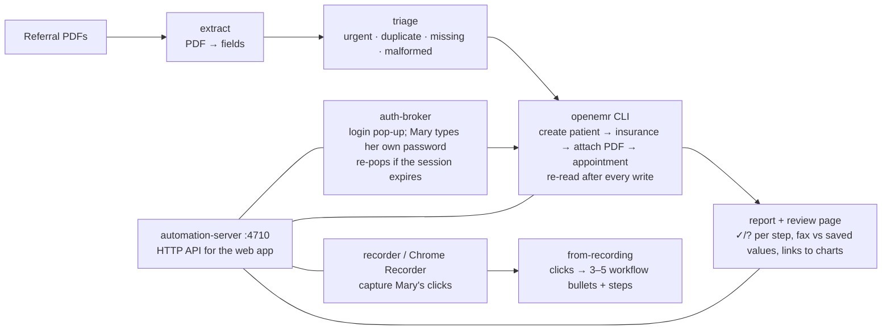

# Team briefing: browser automation + workflow capture (as of 12:55)

**What it does:** A stack of referral faxes (PDFs) goes in. For each one, OpenEMR ends up with a new patient, their insurance, the fax attached to the chart, and a New Patient appointment. Every write is re-read to prove it saved, and anything it can't verify is held for Mary instead of guessed.
**Demo system:** OpenEMR public demo. Stage copy: https://demo.openemr.io/a/openemr (clean, reserved for the stage run). Testing copy: https://demo.openemr.io/openemr. Login `admin` / `pass`. Only fake patients, all named `HACKDEMO-…`.
**No API keys needed** to run any of it (Supabase/Apify are optional add-ons).

## How the pieces fit



## The pieces (all in `~/hackathon-2026-09-19/`)

| Folder | What it does | Status (verified) |
|---|---|---|
| `automation-server/` | Local HTTP API the web app calls (must run on the demo laptop: it opens browser windows) | Running on port 4710; all endpoints tested |
| `auth-broker/` | Login pop-up + saved session + automatic re-login | All tests pass, incl. session expiring mid-run |
| `extract/` | Reads referral PDFs into fields (rule-based, 3 known layouts) | 290/290 fields correct on 10 PDFs; never reads the answer key |
| `triage/` | Flags before entry: urgent-first, duplicate patient, missing/malformed field | All 5 flag types fire on the stage copy, zero false duplicates |
| `openemr-cli/` | The `openemr` tool: `intake <pdf>` does the whole referral; also single steps | 2/2 runs verified; proven on stage copy (referral-09, 81s) |
| `test-runner/` | Batch runner + ✓/? report with screenshots and stopwatch | 10/10 referrals, 41/41 steps Confirmed ✓ |
| `from-recording/` | Turns a click recording into workflow bullets + steps | 12/12 on a SCRIPTED test recording; Chrome Recorder import being added |
| `referrals/` | 10 fake referral PDFs (3 layouts, 2 fax-look) + answer key | Generated + verified |
| `ground-truth/` | Exact click path for one referral (24 steps, screenshots) | Done |
| `submission/` | Demo plan, Loom script, write-up, setup prompt for Mary's AI, README draft | Drafts; setup prompt has real commands |
| `supabase-sync/`, `docs-crawl/` | Optional: audit trail + public review link (Supabase); live docs search (Apify) | In progress, waiting on keys |
| `repo/` | Clean copy being packaged for the public GitHub repo | In progress; not pushed anywhere |

## Server API (for the front end), base `http://localhost:4710`
- `POST /login` `{"site":"a"}`: pops the login window; returns `LOGGED_IN`
- `GET /status?site=a`: `LOGGED_IN` / `LOGGED_OUT`
- `POST /intake` `{"site":"a","limit":3,"headed":true}`: runs referrals end to end (visible browser if `headed`)
- `GET /review/latest`: Mary's review page (fax vs saved values, links to charts); `POST /review/<id>/mark`: her sign-off
- `GET /report/latest`: ✓/? report with stopwatch · `POST /record` + `GET /recordings/latest`: capture clicks
One browser job at a time (a second call gets "busy").

## Try it (on the demo laptop)
```
curl -s localhost:4710/health
curl -s -X POST localhost:4710/login -H 'content-type: application/json' -d '{"site":"a"}'
open http://localhost:4710/report/latest
```

## Honest limits (say these, don't hide them)
- PDF reading is rule-based for our 3 fake layouts, so say "these referral faxes", not "any fax".
- Needs a laptop with a screen (login window); not deployable to a server as-is.
- Runs on a shared public demo; other people can change data there.
- Built with Claude Code helper agents; the team app is built in Cursor. Credit tools accurately.
